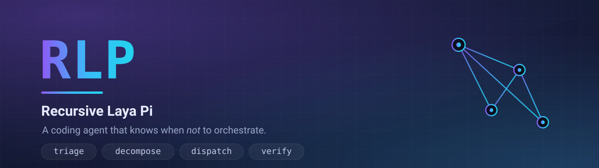

<p align="center">
  
</p>

<p align="center">
  <a href="https://github.com/senghan1992/RLP/actions/workflows/ci.yml"></a>
  <a href="LICENSE"></a>
  
  
  
</p>

<h3 align="center">A coding agent that knows when <em>not</em> to orchestrate.</h3>

Most "multi-agent" tools fan out on every request: a decomposer, a DAG table, a
worktree per node — even to fix a typo. RLP starts by deciding whether a request
deserves orchestration at all. One non-autoregressive forward pass through a
421M-parameter decision model answers `direct` or `orchestrate`; only work that
earns it is decomposed, routed across models, and dispatched to parallel workers
in isolated git worktrees. Everything else is handled inline like a normal
coding agent.

RLP is built on three things, each used for what it is good at, plus a decision
layer that exists nowhere else:

- **[pi](https://github.com/earendil-works/pi)** — the terminal harness the agent
  runs on. RLP builds a lightly-patched fork of it (`rpi`) and is a superset of
  it: everything pi does, plus the orchestration surface. Workers run on `rpi`
  too — or on any other coding CLI this host has and the ladder mounts (`claude`,
  `omp`, `jcode`, `muse`), each invoked headless from the harness catalog.
- **[laya](https://huggingface.co/convaiinnovations/laya)** — the
  non-autoregressive System-1 decision model behind the triage gate and the router.
- **RLM (Recursive Language Models)** — recursive, model-driven decomposition of
  a request into a task DAG, and the recursion that re-splits a node that failed.

Orchestration needs no server, no daemon and no runner: dispatch is a `spawn`,
collection is reading a file, and the run directory (`~/.rlp/runs/<id>/`) holds
the ledger, every worker's log and every worker's report.

---

## Contents

- [Install](#install) · [First run](#first-run) · [How it works](#how-it-works) · [The model ladder](#the-model-ladder--configuration-not-prose)
- [Planning quality, verification, memory](#planning-quality-verification-and-memory)
- [Commands](#commands) · [Safety](#safety-and-guardrails) · [Troubleshooting](#troubleshooting)
- [Environment](#environment-knobs) · [Project layout](#project-layout) · [Development](#development)
- [Security](SECURITY.md) · [Changelog](CHANGELOG.md)

---

## Install

One line — fetches the installer, RLP, the harness, and the engine:

```bash
curl -fsSL https://raw.githubusercontent.com/senghan1992/RLP/main/install.sh | sh
```

Then, in any project:

```bash
cd ~/my-project
rlp                            # interactive agent — decides per request
rlp -p "add a --wc flag, test it, document it, and review the diff"
rlp plan "same request"        # plan only: gate -> DAG -> routes -> waves
```

Prefer a checkout? The bootstrap delegates to the same installer:

```bash
git clone https://github.com/senghan1992/RLP.git
cd RLP && sh scripts/install.sh
```

**That installs a release, not the development branch.** The bootstrap resolves
the newest `v*` tag on the remote and installs it, so the one-liner gives
everyone the same reviewed commit. Override with:

```bash
RLP_REF=v0.3.0 curl -fsSL … | sh   # pin an exact release
RLP_REF=main   curl -fsSL … | sh   # track the development branch
RLP_DIR=/opt/rlp RLP_REPO=… sh     # where it lands, and from where
```

RLP goes into `${RLP_DIR:-~/.local/share/rlp}`, with `rlp` and `rpi` symlinked
into `~/.local/bin`.

### Updating

```bash
rlp update            # RLP to the newest release, the harness fork to newest upstream
rlp update --check    # what it would do; changes nothing
rlp version           # what you are running, and what it was built from
```

`rlp update` does both halves, because that is what "update" means: it moves
RLP's own checkout to the newest release (re-syncing the extensions, skills and
— without touching your model choices — the ladder), then merges the newest
upstream pi into the harness fork, re-applies RLP's patch, verifies the RLP
surface survived the merge, and rebuilds. A dirty checkout is never reset: it
says so and leaves it alone. Paste `rlp version` into any bug report — it names
the release, the exact commit, whether the tree is dirty, and the harness build.

`rlp` is a superset of the harness: for solo work with no orchestration at all,
the same binary is available as `rpi` (RLP execs it internally, so you normally
never type it).

### Requirements

- `git`, `node` ≥ 18 with `npm`, `python` ≥ 3.10
- ~1.5 GB of disk (the harness, a CPU-only torch, and the laya checkpoint)
- Model credentials: RLP keeps its own state under `~/.rlp/agent/` —
  `auth.json` + `models.json`, never writing to pi's `~/.pi`. But RLP is pi's
  fork, so it does not make you retype what pi already has: if pi is logged
  into providers on this host, `/setup` offers to copy them in (one-way, and
  the scan sees only which providers exist — never their keys). Any
  OpenAI-compatible provider works. Starting `rlp` for the first time asks for
  them (the guided setup), `/provider connect` attaches one on its own,
  `rlp provider` is the scriptable equivalent, and a hand-edited file works too.
The installer uses [`uv`](https://github.com/astral-sh/uv) when it is present and
plain `pip` otherwise. By default there is **no venv**: the engine is pip-installed into your existing python (≥ 3.10), like any other package. Pass `RLP_ENGINE=venv` to install it in a self-contained `rlp-svc/.venv` instead (isolated from the system python; the old default, still fully supported):

```bash
sh scripts/install.sh                # RLP_ENGINE=system (default): no venv
RLP_ENGINE=venv sh scripts/install.sh # isolated .venv, system python untouched
```

### First run

```bash
rlp            # the agent, in the project you are working on — and it asks
```

**You do not have to know the word `/setup`.** A host with no credential and no
model arms cannot do anything yet, so the first time you start `rlp` in a
terminal the guided setup begins by itself: the mode, then — if other coding
CLIs are already installed here — the offer to mount them as workers (a PATH
lookup that spawns nothing; `RLP_HARNESS_SCAN=0` keeps the question unasked),
then — because RLP is pi's fork — the providers **pi itself is already logged
into**, offered as one batch to copy in as they are (the scan reads pi's store
for existence only: no key value ever reaches the screen, `rlp provider scan`
is the same look in a shell, and the copy is one-way, so pi's files are never
touched). Then the endpoints and their keys, the model RLP works on, the
worker arms, and the model for each role. Every question is skippable, each
one says what it changed, and answering all of them with escape writes nothing
at all — which is why being
asked again next launch is honest rather than a nag. `RLP_NO_SETUP=1` is the
quiet start for a session nobody is sitting at; `/setup` runs it again by hand,
and `rlp doctor` says the same thing in a shell.

The first question is the one everything else depends on:

| Mode | What RLP does with a request |
|---|---|
| **full** | the laya gate decides each time — inline when one agent can finish it, a fan-out of workers when the work earns it |
| **direct-only** | always inline. No gate, no DAG, no workers, and the 421M decision model is never loaded at all |

```bash
/direct on                    # in a session: stop orchestrating (stored in the ladder)
/direct off · /direct status  # hand it back · say which mode is in effect and what put it there
rlp mode direct|full          # the same switch outside a session
rlp --direct                  # direct-only for one launch, without touching the ladder
RLP_DIRECT=1 rlp              # the same, in any argument position
```

Direct-only mode is a supported way to use RLP, not a crippled one: it is the
harness, the extensions and the same guardrails with the fan-out switched off.
`rlp doctor`, `rlp ladder` and `rlp progress` all report it as a choice rather
than as a missing ladder, and `rlp progress` stops counting the milestones that
only exist for orchestration.

This is on purpose in the other direction too: RLP ships no default model names,
because a model ref only means something on a host that has that provider.

Attaching an endpoint on its own is `/provider connect`: pick from a preset
(OpenAI, Anthropic, OpenRouter, Groq, DeepSeek, Qwen, Ollama, any local
OpenAI-compatible server), paste a key, and then choose **from the list the
endpoint reports** over `GET /models` rather than typing an id from memory.
`/provider test <id>` does one real round trip and, when it fails, says *which*
failure it is — a rejected key, a wrong URL, a model id the endpoint does not
serve, no network, TLS — with a fix for each.

---

## How it works

```
request
  │  rlp_triage            laya, one forward pass -> direct | orchestrate
  ├─ direct ──────────────► stop. One edit, one test, one report. No DAG, no workers.
  │
  └─ orchestrate
       │  rlm_decompose   request -> 2–12 node DAG (recursive, validated)
       │  plan critique   a critic may repair the DAG before anything runs
       │  route           per node: worker + model (role binding or arm priority)
       │  waves           topological levels = one dispatch batch each
       │  dispatch        one headless worker per node, own git worktree + branch
       │  verify          an independent, cross-vendor best-of-N verdict
       │  remember        durable facts persist for the next run
       └─ synthesize      one report: what, where, verified how, what's left
```

The gate is the cheap decision made before the expensive one. Uncertain calls
default to **direct** — a single agent doing big work inline is still correct,
while forcing a one-line fix through a fan-out is pure waste. Because the bundled
laya checkpoint is weakly calibrated, the default gate is *hybrid*: when laya is
unsure, deterministic fan-out signals (an explicit "in parallel"/"delegate" cue,
an implementation plus an independent review, several deliverable verbs joined
into clauses) may raise the call to `orchestrate` and name the signal that fired.

`routing.gate` can also be **`direct`**, which takes the decision away from the
model entirely: every request is handled inline, no fan-out is ever planned, and
laya is never loaded — the ~150 s and a few hundred MB are not spent on a
question with a constant answer. That is `/direct on`, `rlp mode direct`, or
`rlp --direct` for one launch, and it is a supported way to run RLP rather than a
disabled one: the harness, the extensions and the guardrails are all still there.

**The human always merges.** RLP commits branches and can open PRs. It never
merges, never force-pushes, never touches a protected branch.

Deep dives: [docs/CONCEPTS.md](docs/CONCEPTS.md) (what it is and how to drive it)
and [docs/ARCHITECTURE.md](docs/ARCHITECTURE.md) (a one-page diagram).

Under `~/.rlp/`, one directory per concern:

| Path | Holds |
|---|---|
| `~/.rlp/agent/` | the harness state: `settings.json`, `auth.json`, `models.json`, `sessions/`, `extensions/`, `skills/`, `orchestration.json` |
| `~/.rlp/runs/` | per-run ledgers, worker logs and reports |
| `~/.rlp/memory/` | the per-project knowledge log |

Nothing here is shared with pi: RLP's fork defaults to `~/.rlp/agent` through its
own `piConfig.configDir`, and `rlp doctor` prints which directory it resolved.
`RLP_CODING_AGENT_DIR` (or the harness's older `RPI_CODING_AGENT_DIR`) moves the
agent dir; `RLP_HOME` moves the run/memory data only.

---

## The model ladder — configuration, not prose

Every model RLP can spend on lives in one file, `~/.rlp/agent/orchestration.json`.
The harness renders it into the agent's prompt, the router derives its roster
from it, and the headless planner reads the same file — a model name is never
written twice.

**RLP ships this file with policy and no model arms** — `"brain": null` and an
empty `models` array. That is deliberate: a `provider/model` ref only means
something on a host that has that provider, so RLP will not guess one. A
plausible-looking default would make every fresh install plan dispatches onto a
model the host cannot serve, and that failure surfaces at the worker, three
steps from its cause. `/setup` reads your endpoint's own model list and writes
the arms; until then `rlp doctor` says so in one line and every request is
handled inline.

Filled in, it looks like this (the provider ids are whatever *you* connected):

```jsonc
{
  "brain": "openai/gpt-5.1",
  "workers": [
    { "id": "pi", "harness": "pi",
      "models": [
        { "model": "openai/gpt-5.1",
          "roles": ["code", "research", "docs", "review"],
          "when": "DEFAULT arm — most usage headroom; spend the bulk here" },
        { "model": "anthropic/claude-opus-5-5",
          "roles": ["code", "debug", "review"],
          "when": "deep arm — multi-file refactors and hard debugging" }
      ] },
    { "id": "claude", "harness": "claude",       // an external tool can run workers too
      "models": [
        { "model": "claude/default",             // <harness>/<its own model id>; `default` lets it choose
          "roles": ["code", "review"],
          "when": "the host's Claude Code — cross-tool review of pi-written code" }
      ] }
  ],
  "roles": { "review": ["anthropic/claude-opus-5-5"] },
  "routing": { "escalateBelow": 0.55, "maxDispatchesPerTurn": 4,
               "gate": "hybrid", "signalThreshold": 1, "workerTimeoutMs": 1200000,
               "tmux": "auto" },
               // gate: "laya" | "hybrid" | "direct" — direct never orchestrates
               // tmux: "auto" | "on" | "off" — a lens for watching, never a dependency
  "review": { "crossVendor": true },
  "rlm": { "maxDepth": 1, "maxIterations": 8, "maxConcurrentSubcalls": 4, "maxTimeout": 300 },
  "planning": { "critique": true, "maxRefines": 1, "recursiveDepth": 1,
                "artifactPassing": true, "verifySamples": 3 }
}
```

- **Arms are priority-ordered.** The first arm is the default — where the bulk of
  the spend goes; `when` is the operator's reasoning, kept next to the model.
- **`rlm.maxTimeout` is a budget for the whole decomposition**, not per attempt:
  the planner's candidate arms (configured planner → the DEFAULT arm → the fast
  arm, then the same list for the plain-LLM contingency) share it, so a gateway
  that hangs instead of erroring cannot hold a plan open for the arm count times
  the timeout. `maxIterations` and `maxConcurrentSubcalls` bound the recursion.
- **`roles` binds a role to a model** (`code`, `debug`, `review`, `research`,
  `docs`, `explore`) or to an **ordered fallback list**, and it wins over
  priority order. Three roles name models the *planner itself* uses, never a
  worker: `plan` (the decomposer), `critique` (the plan critic), `verify`.
- **`harness` names the program that runs the worker**, not just its model. The
  default is `pi` (RLP's own fork); `claude`, `omp`, `jcode` and `muse` are
  catalogued external tools, each with its own headless invocation. An arm on an
  external worker is `<harness>/<that tool's model id>` — `claude/default` says
  "let the tool pick" instead of naming a model it may not have. What is
  dispatchable is driver presence, not a name list: `rlp harness list` shows
  what can run workers here.
- **`available: false`** removes a worker from the router roster entirely, so
  the planner never dispatches onto an arm the host cannot serve. The same
  exclusion is *computed* for free: a worker whose external tool is not on this
  PATH drops out in memory before routing — the ladder file is never edited.
- **Cross-vendor review is checked, not hoped for**: a review node inherits the
  ban list of the implementation it reviews — both the model families and the
  *tool vendors* behind the code — and is re-picked onto another vendor when the
  ladder allows.
- **`routing.tmux`** (`auto` | `on` | `off`) changes only how workers are
  watched, never how they run: with tmux present, each headless worker sits in a
  window on RLP's own socket (`tmux -L rlp`) so `/rlp-watch` can hand you its
  attach command. RLP never attaches to, sends keys into, or kills anything on
  your own tmux server; without tmux the same workers spawn plainly.

### Change the models live

The ladder is editable from inside a session — no rebuild, no hand-editing JSON:

```
/rlp-config                 show the ladder, or open an edit menu
/rlp-config brain <ref>     make a model the orchestrator
/rlp-roles                  the model each role resolves to
/rlp-roles --pick           pick a role, then multi-select a provider's models
/models --pick              switch model · set default · add as a ladder arm ·
                            bind as the model for a role
```

Every edit is validated **before** it is written, keeps a timestamped backup, and
replaces the file atomically. The same edits are scriptable:
`rlp config '[{"op":"set_brain","model":"p/m"}]'`.

---

## Planning quality, verification, and memory

Effective fan-out is three things: the plan is checked before it runs, the
handoff between nodes is machine-readable, and the tool learns between runs.

- **Critique + repair.** After decomposition a cheap critic judges the DAG
  against the request (bad briefs, overlapping parallel work, missing edges,
  over/under-splitting) and may return a corrected DAG, validated before it is
  accepted. Bounded by `planning.maxRefines`.
- **Recursive re-plan.** A node that fails twice, or reports
  `acceptance: fail`, can be re-decomposed *as a node* — `rlp_replan(node)` splits
  it into a sub-DAG, re-parents its dependents, and makes the sub-nodes
  dispatchable. Bounded by `planning.recursiveDepth`.
- **Structured handoff.** Every worker writes a `report.json`
  (`{status, acceptance, files, commands, summary}`); dependents receive a short
  digest plus the **path** of each dependency report and read it themselves,
  rather than 12 kB of inlined text.
- **Independent verification.** `rlp_verify(node)` asks a **different vendor
  family** than the implementer for a best-of-N majority verdict on the node's
  acceptance and evidence (`planning.verifySamples`).
- **Project memory.** `rlp_remember` appends a durable fact (a pitfall, a
  decision, a rejected acceptance) to an append-only, per-project log at
  `~/.rlp/memory/`. `rlp_plan` folds a brief of it into the decomposer's context,
  so the second run in a project starts from what the first learned.

---

## Commands

### `rlp` — the agent, and the engine

| Command | What it does |
|---|---|
| `rlp` | the interactive agent; triages each request, orchestrates when it earns it |
| `rlp --direct` | the same agent, never orchestrating, for this launch only |
| `rlp -p "<request>"` | the same, non-interactive |
| `rlp plan "<request>"` | the whole decision headless: gate → DAG → routes → waves (executes nothing) |
| `rlp triage "<request>"` | the gate alone, one laya forward pass |
| `rlp decompose "<request>"` | the DAG on its own |
| `rlp route --title T --domain D` | route one subtask to a worker |
| `rlp replan "<node brief>"` | recursively re-decompose one task into a sub-DAG |
| `rlp digest [--run ID] [--wave N]` | condense a finished wave's reports into a handoff — RLM over reports; the `engine` label and the byte counts say who wrote it and how much it shrank |
| `rlp verify --acceptance A --avoid-family F` | independent cross-vendor best-of-N verdict |
| `rlp ladder` · `rlp roster` | the resolved ladder · the router's roster cards |
| `rlp harness list` · `rlp harness scan` | which tools can run workers, and which are on this host (`--no-versions`: a PATH lookup that spawns nothing) |
| `rlp mode [direct\|full]` | does this host orchestrate? no argument reports the mode and what set it |
| `rlp provider list` | every endpoint: credential state, models, and the ladder arms it carries |
| `rlp provider probe <id>` | one real round trip; a failure comes back classified, with a fix |
| `rlp provider discover <id>` | ask the endpoint which models it serves |
| `rlp provider add <id> <url> <model…> [--key-stdin]` | attach an endpoint (validated, backed up, `0600` auth) |
| `rlp provider key <id> [--drop]` · `remove <id> [--drop-key]` | manage a credential · detach an endpoint |
| `rlp provider scan` · `import <id…>` | what pi itself has connected (presence only, never values) · copy one or more in verbatim — validated, backed up, `0600`, one-way |
| `rlp config '<ops-json>'` | edit the ladder (validated, backed up, atomic) |
| `rlp memory` · `rlp remember "<text>"` | the project's cross-run knowledge log |
| `rlp doctor [--warm]` | is this host runnable? one fix per failure |
| `rlp progress [--json]` | how far this host is from installed to working, and the next step |
| `rlp update [--check]` | RLP to the newest release + the fork to newest upstream, verified |
| `rlp version [--json]` | the release, the commit, the harness build — what a bug report needs |
| `rpi` | the same harness with no orchestration surface at all |

Add `--json` to any engine subcommand for the raw envelope. Exit codes:
`0` valid · `1` `ok:false` · `2` usage · `3` doctor found a failure.

### Inside a session (slash menu)

| Command | What it does |
|---|---|
| `/setup` | guided first run: mode → (tools already on this host) → endpoints → model → worker arms → per-role models |
| `/direct on\|off\|status` | direct-only mode: work inline and never orchestrate |
| `/rlp` | status card (ladder, brain, endpoints, unusable arms) + an action menu |
| `/rlp-plan <request>` | the headless plan, rendered in chat |
| `/rlp-triage <request>` | the gate verdict alone |
| `/rlp-doctor` | host health |
| `/rlp-ladder` | the resolved ladder in full |
| `/rlp-config` | show or edit the ladder (brain, arms, roles, gate, RLM knobs) |
| `/rlp-roles` | the model each role resolves to, and the menu to change it |
| `/rlp-watch` | the run's live worker windows and how to attach to each (read-only; RLP never attaches for you) |
| `/commands [filter]` | the whole slash index, grouped (harness, RLP, skills, optional extensions) |
| `/models [filter]` · `/models --pick` | models by provider, with ladder and credential marks |
| `/provider` | endpoints, credential state, live connection test, and which arms cannot run |
| `/provider connect` · `add` · `test` · `models` · `key` · `remove` | the guided attach, the scriptable attach, a round trip, discovery, credentials, removal |

Reading commands change nothing. The ones that write back up first: `/rlp-config`
and `/rlp-roles` edit the ladder (validated, timestamped backup, atomic replace),
and `/provider` / `/setup` edit the ladder and the provider store under the same
rules — a credential is never printed and never placed on a command line.

---

## Safety and guardrails

- **Guardrails are configuration.** `maxDispatchesPerTurn` caps a turn's fan-out;
  `workerTimeoutMs` kills a wedged worker so collection cannot block forever.
- **Preflight, not hope.** A node whose arm has no credential, or whose harness
  cannot run here — no driver in the catalog, or the tool not on this PATH — is
  failed with a fix line instead of burning a dispatch (`rlp_plan` surfaces
  these under `preflight`). Unknown harness names are never silently dropped:
  they parse with a warning and fail loudly at dispatch, not silently elsewhere.
- **Cross-vendor review** is verified against the ladder's families — models and
  tool vendors — and reported as a violation when it cannot be satisfied.
- **External tools run as themselves.** A worker on `claude` or `jcode` executes
  that CLI headless with the session's own environment; RLP injects no
  credential into it, and the catalog records env-var *names*, never values. Each
  tool's permission flags are plain `argv` data in `rlp-svc/rlp_svc/harnesses.py`
  — including why Claude runs with `--dangerously-skip-permissions`, and how to
  narrow it: see [SECURITY.md](SECURITY.md).
- **Never merges.** Branches and (with a GitHub remote) PRs only.
- **Secrets stay out of the repo.** Credentials live in `~/.rlp/agent/`, outside
  the checkout and git-ignored.
- **Credentials are handled as credentials.** `auth.json` is written `0600`;
  nothing ever prints a key (only `present`/`absent`); every write to it or to
  `models.json` is validated first, backed up, and replaced atomically; and a
  key is never passed on a command line, where `ps` could read it — the TUI
  hands it over a pipe (`--key-stdin`).
- **pi's store is a source, never a target.** Reading it for `provider scan`
  records only that a credential exists — the value never enters a report, a
  dialog or an error; `provider import` copies entries verbatim into RLP's own
  store under the rules above, and never writes back to pi.

---

## Troubleshooting

```bash
rlp doctor            # every failure with a one-line fix (~0.2 s)
rlp doctor --warm     # plus one real laya round trip (~150 s cold on CPU)
rlp provider list     # endpoints, credentials, and the arms that cannot run
rpi                   # the bare harness, no orchestration — isolate the harness
```

| Symptom | Try |
|---|---|
| `rlp: decision engine not installed` | `sh scripts/install.sh` |
| nothing ever orchestrates, even for obviously multi-part work | `rlp ladder`'s `mode:` line first (direct-only is a choice), then the arms: `NOT CONFIGURED` means `/setup` fills it |
| `the laya decision model` seems stuck | first load is ~150 s on CPU; it is loaded once per session in the background |
| a request never fans out | the gate defaults to direct; use `rlp plan --mode orchestrate --because "…"` or ask explicitly |
| nothing orchestrates *at all*, and `/rlp-plan` says `direct-only mode` | the mode, not a fault: `rlp mode` (or `/direct status`) says whether it came from `routing.gate` or `$RLP_DIRECT`; `/direct off` ends it |
| a worker dies instantly | `rlp doctor` — usually a missing credential for that arm (`/provider key <id>`, or `/login <provider>`) |
| a model is in the list but nothing runs on it | it is not a *ladder arm*: `/provider` names this under "ladder arms that cannot run", `/rlp-config add-arm` attaches it |
| a connection fails and you cannot tell why | `/provider test <id>` — a rejected key, a wrong URL, a bad model id, no network and TLS are told apart, each with a fix |
| `/settings` or `/model` default ignored | managed worker sessions follow `RPI_DEFAULT_MODEL`; interactive sessions keep your saved default |

---

## Environment knobs

| Variable | Effect |
|---|---|
| `RLP_CODING_AGENT_DIR` | RLP's agent dir (`~/.rlp/agent` by default) |
| `RPI_CODING_AGENT_DIR` | the same, under the harness's own name — still honoured |
| `RLP_ORCHESTRATION` | path to the ladder, overriding `<agent dir>/orchestration.json` |
| `RLP_DIRECT=1` | direct-only for this session: outranks the ladder, cleared by `/direct off` |
| `RLP_NO_SETUP=1` | do not run the guided setup on first launch (sessions with no keyboard at the other end) |
| `RPI_DEFAULT_MODEL` | the `rpi` session default (`provider/model`) |
| `RLP_DECOMPOSE_MODEL` · `RLP_CRITIQUE_MODEL` · `RLP_VERIFY_MODEL` · `RLP_ROUTE_MODEL` | override the planner / critic / verifier / router model (`provider/model`); each otherwise comes from the ladder |
| `RLP_RLM_DECOMPOSE=1` | the decomposition spike: the RLM loop submits its DAG as an `emit_dag(answer, tasks)` tool call instead of prose JSON (reported as `engine: rlm+emit_dag`); off by default |
| `RLP_SKIP_CREDENTIAL_PREFLIGHT=1` | skip the per-arm credential check |
| `RLP_NO_MIGRATE=1` | do not copy credentials out of pi's `~/.pi` on install |
| `RLP_PI_AGENT_DIR` | where pi's own store lives for `provider scan`/`import` (`~/.pi/agent` by default) |
| `RLP_PI_MODELS` · `RLP_PI_AUTH` | relocate RLP's two provider files individually |
| `RLP_HOME` | where run ledgers and project memory live (`~/.rlp`) |
| `RLP_PI_REPO` · `RLP_PI_REF` | fork source · upstream ref, overriding the pin in `scripts/rlp-fork.base` |
| `RLP_REBUILD=1` · `RLP_ORCH_FORCE=1` | force a fork rebuild · overwrite the installed ladder |
| `RLP_ENGINE=system` (default) / `RLP_ENGINE=venv` | where the engine's python lives: no venv (pip into a PATH python) vs. a self-contained `rlp-svc/.venv` |
| `RLP_SKIP_MODELS=1` | install without torch/laya/rlm and the checkpoint — everything that does not run a model still works |
| `SSL_CERT_FILE` | CA bundle (needed behind a TLS-inspecting proxy) |

---

## Project layout

```
RLP/
  install.sh          # the curl|sh bootstrap (also runs from a checkout)
  fork/pi/            # the pi fork — CLONED + BUILT by install.sh, never committed
  rlp-svc/            # the decision engine: MCP server + CLI + library
    rlp_svc/          #   triage, decompose (RLM + critique), route, verify,
                      #   memory, plan, orchestration ladder, providers,
                      #   doctor, engine, cli
  agent/rlp/          # what install.sh drops into ~/.rlp/agent
    extensions/       #   rlp-orchestrate (orchestration), rlp-provider
                      #   (endpoint/credential wizards), rlp-commands, menus
    skills/           #   /skill:rlp-* — workflow, models, engine, doctor, commands
    orchestration.json#   the ladder: policy, and no model arms (see above)
  scripts/            # install, sync-agent-dir, rlp/rpi wrappers, rlp-update,
                      #   release + changelog-section, selftest,
                      #   rlp-fork.patch + rlp-fork.base (the pinned upstream),
                      #   check-harness + check-provider + check-first-run
  docs/               # CONCEPTS.md, ARCHITECTURE.md
```

## Development

```bash
sh scripts/selftest.sh --fast   # extension typecheck + offline suite (seconds)
sh scripts/selftest.sh          # + real models and every live-session check (~4 min)

node scripts/check-harness.mjs  # commands load, no duplicate registrations
node scripts/check-provider.mjs # /provider and /setup, driven through a live session
sh scripts/check-first-run      # every non-ok doctor line names an actionable fix
```

The offline suite stubs every model layer (including the provider transport) and
runs in milliseconds: `python3 -m rlp_svc.tests` (venv-less: any python with
the engine installed; `sh scripts/svc-py` resolves which one).

**CI runs the live-session checks too**, on every push. It builds the real
harness, drops in the real extensions, and types slash commands into a real
session over RPC — a provider wizard is a conversation, and stubbing the
conversation tests the stub. That is affordable because of
`RLP_SKIP_MODELS=1 sh scripts/install.sh`, which installs everything except
torch, laya, rlm and the 400 MB checkpoint: none of it is needed to prove the
commands load and the dialogs behave. The same flag is useful for a container
image, or for anyone who only wants the parts that do not run a model.

A scheduled `upstream-drift` job runs the real `rlp update --no-self` against
current upstream pi once a week. Installs pin the upstream commit, which is what
makes them reproducible — and also what means nothing would notice upstream
refactoring past the patch until someone ran `rlp update`. A failure there is not
a broken release; it is notice that the next update will not work.

### The fork patch

`fork/pi` is a real checkout: upstream, plus **one commit** carrying
`scripts/rlp-fork.patch` on a branch named `rlp`. Edit the fork's source, then
regenerate the patch rather than hand-editing it:

```bash
cd fork/pi
git add -A && git commit --amend --no-edit
BASE=$(git merge-base origin/main HEAD)
git diff "$BASE" HEAD > ../../scripts/rlp-fork.patch
git rev-parse "$BASE"        # write this into scripts/rlp-fork.base
```

`scripts/rlp-fork.base` records the upstream commit the patch applies to, and
`install.sh` fetches exactly that commit. The two files are one fact in two
places and only mean anything as a pair, so regenerate them together. Pinning is
what makes an install reproducible: the installer used to clone upstream's
default branch, and by the time anyone checked, upstream had moved past the
patch and a fresh `curl | sh` failed for everyone.

`scripts/rlp-update` greps the built fork for RLP's fingerprints
(`check_markers`), so a marker removed from the patch has to be removed there
too — otherwise the next upstream merge reports a loss that is not one.

### Cutting a release

```bash
sh scripts/release --check 0.3.0   # verify only
sh scripts/release 0.3.0           # bump, close the changelog, commit, tag
git push origin main && git push origin v0.3.0
```

`scripts/release` refuses a dirty tree, a version that is not greater than the
current one, a tag that already exists, an empty `## Unreleased` section, or a
failing offline suite. It never pushes: `install.sh` installs the newest `v*`
tag, so pushing the tag is the publish, and that is a decision rather than a
side effect. The tag push triggers `.github/workflows/release.yml`, which
re-verifies that the tag matches `rlp_svc.__version__` and that notes exist,
then creates the GitHub release with the changelog section as its body.

The version has exactly one declaration, `rlp_svc.__version__`; `pyproject.toml`
reads it dynamically and `cli.VERSION` aliases it.

## Acknowledgements

RLP stands on [pi](https://github.com/earendil-works/pi) (MIT, © Mario Zechner),
[laya](https://huggingface.co/convaiinnovations/laya), and the RLM line of work on
recursive language models. It builds a patched fork of pi at install time; the
patch lives in `scripts/rlp-fork.patch`.

## License

[MIT](LICENSE).