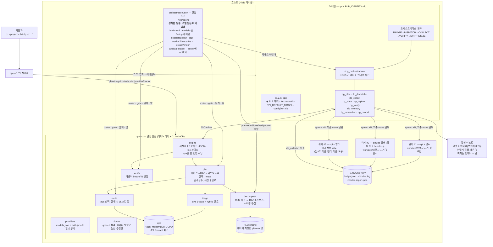
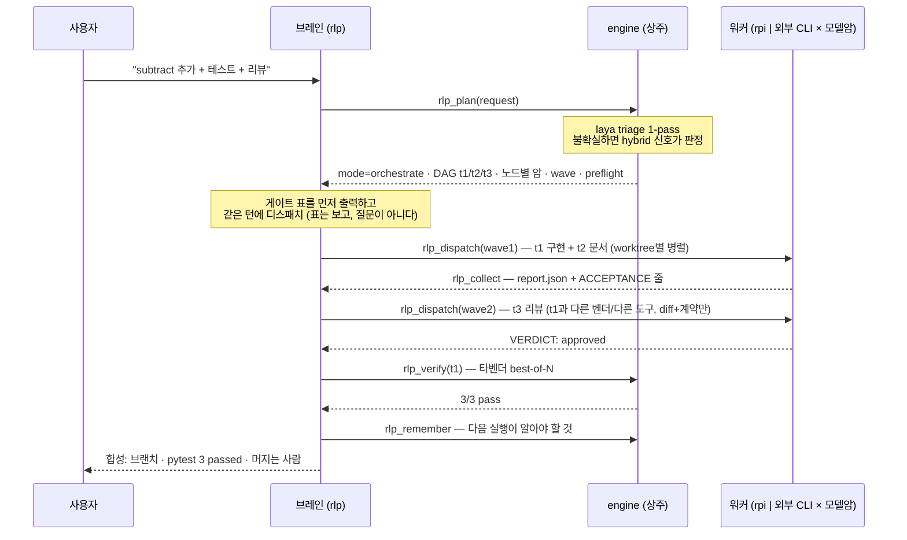

# RLP 전체 구조

## 한 문장으로

RLP는 **하나의 바이너리, 하나의 결정 엔진, 하나의 설정 파일**이다. 서버도
데몬도 runner도 없다. 디스패치는 `spawn`이고, 수집은 파일을 읽는 것이다.

| | 무엇 |
|---|---|
| 진입 | `rlp` (에이전트), `rlp <subcommand>` (결정 엔진), `rpi` (오케스트레이션 없는 하네스) |
| 브레인 | pi 포크 TUI + `agent/rlp/extensions/rlp-orchestrate.ts` |
| 디스패치 | 확장이 워커를 `spawn` — 기본은 `rpi`, 래더가 외부 도구를 마운트하면 그 도구를 카탈로그(`rlp_svc/harnesses.py`)의 headless 호출로 — 노드당 git worktree + 브랜치 |
| 수집 | `rlp_collect`가 결과 파일이 나타날 때까지 블록 대기 |
| 가드레일 | `orchestration.json`의 턴당 cap · 자격증명/하네스 preflight · 워커 워치독 · purpose 화이트리스트 |
| 흔적 | `~/.rlp/runs/<id>/` — ledger, 워커별 로그, 워커별 report.json |

`rlp`와 `rpi`는 같은 바이너리다. 갈라지는 지점은 `RLP_IDENTITY` 하나:
`rlp`는 브레인이라 오케스트레이션 계약과 `rlp_*` 도구와 상주 laya 엔진을
받고, `rpi`는 맨 하네스다. 워커도 맨 상태로 돈다 — pi 워커는 `rpi`를
spawn하고, 외부 도구(claude·omp·jcode·muse) 워커는 카탈로그가 아는 그 도구
자신의 headless 호출로 뜬다. 어느 쪽이든 워커가 자기 노드를 또 triage하거나
쓰지도 않을 laya를 150초 로딩하는 일이 없다.

---

## 아키텍처 — 한 장으로

## 요청 수명주기

실패 경로도 같은 그림이다. 워커가 죽거나 `ACCEPTANCE: fail`을 남기면 브레인은
**한 번** 다른 암으로 재디스패치하고, 두 번째 실패에서 그 노드가 여러 일의
묶음이면 `rlp_replan`이 그 노드만 하위 DAG로 쪼개 의존 노드를 하위 DAG의 잎에
다시 붙인다. 이 재귀는 `planning.recursiveDepth`로 제한되며, 예산을 다 쓰면
루프 대신 "여기까지"를 보고한다.

## 레이어별 역할 (왜 이 세 가지인가)

| 레이어 | 기반 | 담당 | 대체 불가 이유 |
|---|---|---|---|
| **판단** | laya | triage 게이트 + 노드→worker 라우팅 (33–460ms, 생성 없음 = 할루시네이션 없음) | 분할·선발은 추론이 아니라 분류 — 느린 LLM에 돈 쓸 일이 아니다 |
| **계획** | RLM | 요청 → 2–12 노드 DAG (재귀 분해 + 검증/Kahn + 비평 수정) | 래더는 "어디로"만 안다 — "무엇을"이 여기서 나온다 |
| **기반** | rpi (pi 포크) + 카탈로그의 외부 도구 | 브레인이 도는 하네스; pi 워커도 여기서 돌고, 외부 도구 워커는 각 도구의 headless 호출로 돈다 | 같은 바이너리에 다른 벤더 암을 주입 = 독립 크로스 리뷰가 가능 — 모델 벤더와 도구 벤더 두 축 모두 |

**실행·분배**는 프로젝트가 아니라 RLP 자신이다
(`agent/rlp/extensions/rlp-orchestrate.ts`). 별도 평면을 두지 않은 이유는
단순하다: 두 번째 프로그램이 필요한 단계는 전부 꺼져 있거나, 낡았거나, 방금
업데이트한 코드와 다른 버전일 수 있는 단계다. 그 대신 잃은 것(교차 세션 DB,
웹 UI)은 `~/.rlp/runs/<id>/`가 대신한다 — grep 가능하고, 세션이 끝나도 남는다.

**핵심 연결점**: `orchestration.json` 하나. 하네스가 브레인 프롬프트에 렌더하고,
엔진이 roster/gate/임계를 파생하고, `plan`이 노드별 암을 고르고, `llm.py`가
planner·critique·verify·route 모델을 여기서 해석하고, `doctor`가 검증한다.
프롬프트 산문에도, 파이썬 상수에도 모델 이름이 중복되지 않는다.

**오케스트레이션하지 않기를 유지하는 것**: `rlp plan`은 위 파이프라인을 세션
없이 순수함수로 노출한다. 스크립트·봇·CI·다른 오케스트레이터가 "이 요청을
어떻게 할까"만 물어보고 스스로 실행할 수 있다. 상세: [CONCEPTS.md](CONCEPTS.md).

## 명령

| 명령 | 정체 |
|---|---|
| `rlp` | 단일 진입점 — `plan`/`triage`/`decompose`/`route`/`ladder`/`roster`/`config`/`provider`/`verify`/`memory`/`doctor`/`serve`는 결정 엔진으로, 그 외 인자는 에이전트로. 호출한 디렉터리가 작업 대상 |
| `rlp <subcommand> --json` | 같은 결정, 기계가 읽는 envelope. 종료코드 `0` 정상 · `1` `ok:false` · `2` usage · `3` doctor 실패 |
| `rpi` | 같은 하네스, 오케스트레이션 표면 없음. 한 가지 일만 할 때 |

## 알려진 특성

- **첫 설치는 오케스트레이션을 못 한다 — 의도된 것이다.** 동봉되는 래더는
  정책만 담고 모델 암이 없다(`brain: null`, `models: []`). 모델 참조는 그
  provider를 가진 호스트에서만 의미가 있어서 RLP는 추측하지 않는다. 그럴듯한
  기본 암을 넣으면 모든 신규 설치가 호스트가 서빙 못 하는 모델로 디스패치를
  계획하고, 그 실패는 원인에서 세 단계 떨어진 워커에서 터진다. `rlp ladder`가
  `NOT CONFIGURED`를, `rlp doctor`가 한 줄로 수정안을 말하며, `/setup`이
  엔드포인트의 `GET /models` 응답에서 암을 채운다. 그 전까지 RLP는 평범한 코딩
  에이전트로 정상 동작한다. 그리고 `/setup`을 치기를 기다리지 *않는다*: 자격증명이 없거나 래더가
  dispatch 가능하지 않으면, 터미널에서 `rlp`을 처음 켤 때 설정이 스스로 시작한다(모드 → [이 호스트에 이미 있는 코딩 CLI 감지 — spawn 없는 PATH 조회이고 `RLP_HARNESS_SCAN=0`이면 생략] → [pi가 이미 로그인한 provider 감지 — RLP가 pi의 포크이니 키를 다시 치게 하지 않는다. `provider scan`은 pi 저장소에서 *존재 여부*만 읽고 키 값은 어느 화면에도 실리지 않으며, 복사(pi의 파일을 건드리지 않는 편방향)는 목록을 확정한 뒤에만 일어난다. 신규가 없거나 두 저장소가 같은 디렉터리면 질문 자체가 생략] → 엔드포인트 → 모델 → 워커 암 → 역할별 모델). TUI에서만,
  `RLP_IDENTITY=rlp`일 때만, `RLP_NO_SETUP=1`로 끌 수 있다. 전부 esc로 막으면
  아무 것도 쓰이지 않기 때문에 다음 시작에 다시 묻는 것은 잔소리가 아니라 사실이다.
- laya 게이트의 이 질문 유형 보정은 약하다 (실측 conf 0.003–0.50). 게이트 기본은
  **hybrid**다: laya가 확신하면 그대로, 불확실하면 `triage.py`의 결정론적 fan-out
  신호가 `orchestrate`로 올리고 `engine: laya+signals`·`signals`를 남긴다. 확신한
  laya `direct`는 뒤집지 않는다. `routing.gate: "laya"`로 옛 동작(불확실=direct)
  복원. `routing.gate: "direct"`는 질문 자체를 취소한다 — 모든 요청이 inline이고
  laya는 애초에 로딩되지 않는다(`/direct on`, `rlp mode direct`, 그리고 이번 런만
  `rlp --direct` = `$RLP_DIRECT`). 명백한 `--mode` 오버라이드는 모드를 이긴다:
  빠져나갈 구멍 없는 스위치는 함정이다. 브레인의 최종 어필은 그대로다: 2+ 독립
  산출물을 명명할 때만 escalate.
  CLI에서도 `rlp plan --mode orchestrate --because "…"`가 같은 계약이며 결과에
  `gate_override`로 기록된다.
- 래더는 세션 안에서 편집된다: `/setup`, `/rlp-config`(메뉴 또는
  `brain|add-arm|set-arm|move-arm|rm-arm|worker|gate|mode|escalate|cap|timeout|cross-vendor`),
  `/rlp-roles`, `/models --pick`의 "add to the RLP ladder"/"make it the
  orchestrator", 스크립트용 `rlp config '<ops-json>'`. 쓰기 전에 검증하고
  `.bak.<ts>` 백업 + 원자적 교체를 한다.
- 디스패치 직전 preflight: 배정된 arm의 provider에 자격증명이 없거나 harness를
  이 호스트에서 못 띄우면 그 노드를 디스패치하지 않고 수정 안내와 함께 실패
  처리한다 (`rlp_plan`의 `preflight`에도 노출). 띄울 수 있는 harness는 이름
  목록이 아니라 카탈로그 드라이버의 존재다: pi는 번들이라 상시, claude·omp·
  jcode·muse는 이 호스트 PATH에 있을 때 디스패치 가능하고, 카탈로그에 없는
  이름은 조용히 버리지 않는다 — 파싱은 경고와 함께 통과하고 디스패치 시점에
  큰 소리로 실패한다(D5). plan 시점에 없는 외부 도구는 그 worker를 메모리에서
  unavailable로 접는다 — 래더 파일은 건드리지 않는다.
  `RLP_SKIP_CREDENTIAL_PREFLIGHT=1`로 끌 수 있다.
- 엔진의 LLM 폴백(라우터·triage·비평·검증)은 단일 암이 아니라 래더에서 파생한
  후보 목록을 순서대로 시도한다. 빈 응답 하나로 계획 전체가 끝나던 경로였다.
- 워커 워치독: `routing.workerTimeoutMs`(기본 20분)를 넘긴 워커는 `rlp_collect`가
  종료시키고 failed로 돌려준다. 워커는 프롬프트 계약에 따라 마지막 줄에
  `ACCEPTANCE: pass|fail — …`을 남기고 `<node>.report.json`을 쓴다. 산문이 아니라
  이 둘이 계약이다.
- tmux는 렌즈지 의존성이 아니다: `routing.tmux`(auto|on|off)가 켜 있으면 headless
  워커가 RLP 전용 소켓(`tmux -L rlp`, 세션 `rlp-<run>-<node>`)의 창에서 돌아
  `/rlp-watch`가 창별 attach 명령을 내고, tmux가 없으면 같은 워커가 그냥
  spawn된다 — 완료 판정도 수집도 결국 같은 파일들이라 결과가 다르지 않다.
  RLP는 사용자의 기본 tmux 서버에는 attach도 send-keys도 kill도 하지 않는다;
  만지는 창은 자기가 만든 창뿐이다.
- laya 첫 로딩은 프로세스당 ~170s (CPU 체크포인트). 그래서 엔진은 세션 시작 시
  백그라운드로 뜨고 세션당 한 번만 로딩한다. 프로세스를 재시작하면 다시 로딩한다.
  direct 전용 모드에서는 애초에 띄우지 않는다 — 상답에 대한 질문을 위해 150초를
  쓰지 않는다.
- 원격 없는 저장소에서 워커는 브랜치 커밋까지만 한다. 머지·push·force-push는
  절대 하지 않는다 — 언제나 사람이 머지한다.
