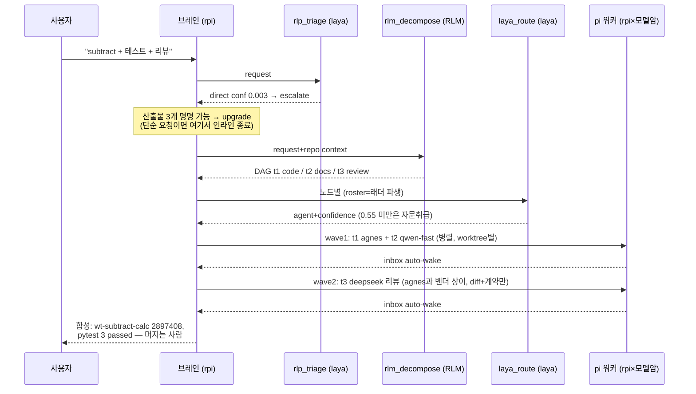

# RLP 전체 구조

## 두 개의 평면 — 먼저 이것

RLP에는 평면이 **둘** 있고, 기본은 첫 번째다.

| | 로컬 오케스트레이션 (기본) | omnigent 평면 (opt-in) |
|---|---|---|
| 진입 | `rlp`, `rlp -p "…"` | `rlp --omnigent` |
| 무엇이 도는가 | pi 포크 TUI + `agent/rlp/extensions/rlp-orchestrate.ts` | omnigent REPL/서버 |
| 디스패치 | 확장이 직접 `rpi` 워커를 `spawn` (노드당 git worktree) | `sys_session_send` + runner + inbox |
| 수집 | 결과 파일을 읽음 (`rlp_collect`가 블록 대기) | inbox auto-wake |
| 가드레일 | `orchestration.json`의 cap + 자격증명/하네스 preflight + 워치독 | nessie 정책 (`config.yaml` guardrails) |
| 세션 DB·웹UI | 없음 | 있음 (`~/.omnigent/chat.db`, :6767) |

**아래 다이어그램은 omnigent 평면(`rlp --omnigent`)을 그린 것이다.** 기본
경로에는 서버·데몬·runner가 없고, 브레인의 `rlp_plan`/`rlp_dispatch`/
`rlp_collect` 도구가 곧 디스패치다. 두 평면 모두 같은 결정 엔진과 같은
`orchestration.json`을 읽으므로 `rlp plan`의 결과는 동일하다.

---

## 아키텍처 — 한 장으로 (omnigent 평면)

```mermaid
flowchart TB
  CLI["rlp (단일 진입점)"]
  CLI -->|plan/triage/route/ladder/doctor| SVC
  CLI -->|그 외 인자 (orchestrator)| SRV
  subgraph host["호스트 (~/.omnigent, ~/.pi)"]
    subgraph omnigent["omnigent 0.14 — 오케스트레이션 평면"]
      SRV[server :6767<br/>세션 상태·웹UI]
      RUN[runner<br/>세션별 실행기]
      BRIDGE["JS extension bridge<br/>pi.registerTool ←→ TCP"]
      INBOX[(inbox<br/>자동 wake)]
      GUARD["guardrails<br/>blast_radius·spawn_bounds(4/turn)·purpose"]
      WT["git worktree<br/>노드별 격리"]
    end

    subgraph rlpbrain["RLP 브레인 (rpi 위 실행)"]
      PROMPT["persona: 0.TRIAGE→1.DECOMPOSE→2.ROUTE<br/>→3.DISPATCH→4.COLLECT→5.SYNTHESIZE"]
      SECT["<rlp_orchestration><br/>시스템 프롬프트 섹션"]
    end

    subgraph rpi["rpi = pi 포크 (하네스)"]
      FORK["pi 0.87.0 + 9패치<br/>◈ RPI 헤더·/orchestration·<br/>RPI_DEFAULT_MODEL·omnigent skill discovery"]
    end

    subgraph ripsvc["rlp-svc — 결정 엔진 (MCP + CLI + 라이브러리)"]
      PLAN["rlp plan (신규)<br/>게이트→DAG→라우팅→암선택→wave<br/>순수함수, 세션 불필요"]
      DOCT["rlp doctor (신규)<br/>graded 점검, 실패마다 수정안"]
      TRI["rlp_triage<br/>laya 1-pass: direct|orchestrate"]
      DEC["rlm_decompose<br/>RLM 재귀 → DAG 2-12노드"]
      RT["laya_route / llm_route<br/>laya 선택 + LLM 강등"]
      ORCH["rlp_orchestration<br/>래더 JSON + 파생 roster + excluded"]
      LAYA[("laya Router<br/>421M ModernBERT, CPU<br/>단일 forward 패스")]
      RLM[("RLM engine<br/>qwen3.8-max 게이트웨이")]
    end

    LADDER["orchestration.json (단일 소스)<br/>brain=agnes · 암 우선순위<br/>agnes(DEFAULT,벌크) → qwen-fast → deepseek<br/>escalateBelow=0.55 · crossVendor<br/>available:false → 라우터 roster에서 제외"]

    WK1["pi 워커 #1<br/>rpi+agnes<br/>subtract+테스트"]
    WK2["pi 워커 #2<br/>rpi+qwen-fast<br/>USAGE.md"]
    WK3["pi 워커 #3<br/>rpi+deepseek<br/>독립 리뷰 (벤더 상이)"]
    WK4["claude_code (opt-in)<br/>실패 시 CLAUDE_EXHAUSTED<br/>→ 즉시 pi로 재디스패치"]
  end

  USER["사용자<br/>cd <project> && rlp -p '...'"]

  USER -->|rlp = omni run| SRV --> RUN
  RUN -->|"--mode rpc --model X"| rpi
  RUN --- BRIDGE --- rpi
  RUN --- GUARD
  PROMPT --- SECT
  LADDER -->|harness가 렌더| SECT
  RUN --- LAYA
  RUN --- RLM
  rpi -->|"MCP call"| TRI & DEC & RT & ORCH
  TRI & RT --> LAYA
  DEC --> RLM
  LADDER -->|roster·gate·임계| RT & ORCH
  RUN -->|sys_session_send ×N<br/>dependency wave| WK1 & WK2 & WK3
  WK1 & WK2 & WK3 --- WT
  WK1 & WK2 & WK3 -->|완료| INBOX -->|auto-wake| RUN
  RUN -->|전 노드 완료| SYN["합성 리포트<br/>브랜치+검증+잔여<br/>(브레인은 안 머지, 사람이 머지)"]
```

## 요청 수명주기 (실측된 것만)



## 레이어별 역할 (왜 4개 프로젝트인가)

| 레이어 | 프로젝트 | 담당 | 대체 불가 이유 |
|---|---|---|---|
| **판단** | laya | triage 게이트 + 노드→agent 라우팅 (33–460ms, 생성 없음 = 할루시네이션 없음) | 분할·선발은 추론이 아니라 분류 — 느린 LLM에 돈 쓸 일 아니다 |
| **계획** | RLM | 요청 → 2–12 노드 DAG (재귀 분해 + 검증/Kahn) | 래더가 "어디로"만 안다 — "무엇을"이 여기서 나온다 |
| **실행·분배** | omnigent | 세션, `sys_session_send`, inbox wake, worktree, 가드레일 | 브레인이 코드를 안 쳐도 되게 하는 평면 |
| **기반** | rpi (pi 포크) | 브레인과 전 워커가 도는 하네스 | 동일 바이너리 3암에 다른 벤더 주입 = 크로스 리뷰 가능 |

**핵심 연결점**: `orchestration.json` 하나 — harness가 브레인 프롬프트에 렌더,
rlp-svc가 roster/gate/임계 파생, `rlp plan`이 노드별 암 선택, `rlp doctor`가
검증. 프롬프트 산문에 모델 목록이 중복되지 않는다.

**오케스트레이션하지 않기를 유지하는 것**: `rlp plan`은 위 파이프라인을 세션 없이
순수함수로 노출한다. 스크립트·봇·다른 오케스트레이터가 "이 요청을 어떻게 할까"를
물어보고 스스로 실행할 수 있다. `available:false`인 워커는 roster에서 빠지므로
실행 불가능한 디스패치를 계획하지 않는다. 상세: [CONCEPTS.md](CONCEPTS.md).

## 명령

| 명령 | 정체 |
|---|---|
| `rlp` | 단일 진입점 — `plan`/`triage`/`decompose`/`route`/`ladder`/`roster`/`config`/`doctor`/`serve` 는 결정 엔진으로, 그 외 인자는 pi 포크 TUI(로컬 오케스트레이션)로. 호출한 디렉터리가 작업 대상 |
| `rlp --omnigent` | omnigent 평면(세션 DB·웹UI)으로 |
| `rpi` | 하네스 — 브랜딩된 pi 포크, 단일 에이전트. 오케스트레이션 없이 일할 때 |

## 알려진 특성

- laya 게이트의 이 질문 유형 보정은 약함 (실측 conf 0.003–0.50). 게이트는 기본이 **hybrid**다: laya가 확신하면 그대로, 불확실하면 `triage.py`의 결정론적 fan-out 신호가 `orchestrate`로 올리고 `engine: laya+signals`·`signals`를 남긴다. 확신한 laya `direct`는 뒤집지 않는다. `routing.gate: "laya"`로 옛 동작(불확실=direct) 복원. 브레인의 최종 어필은 그대로다: 2+ 독립 산출물을 명명할 때만 escalate. CLI에서도 `rlp plan --mode orchestrate --because "…"`가 같은 계약이며 결과에 `gate_override`로 기록된다.
- 래더는 세션 안에서 편집된다: `/rlp-config`(메뉴 또는 `brain|add-arm|set-arm|move-arm|rm-arm|worker|gate|escalate|cap|timeout|cross-vendor`), `/models --pick`의 "add to the RLP ladder"/"make it the orchestrator", 스크립트용 `rlp config '<ops-json>'`. 쓰기 전에 검증하고 `.bak.<ts>` 백업 + 원자적 교체를 한다.
- 디스패치 직전 preflight: 배정된 arm의 provider에 자격증명이 없거나 harness가 로컬에서 못 띄우는 것이면 그 노드를 디스패치하지 않고 수정 안내와 함께 실패 처리한다 (`rlp_plan`의 `preflight`에도 노출). `RLP_SKIP_CREDENTIAL_PREFLIGHT=1`로 끌 수 있다.
- 워커 워치독: `routing.workerTimeoutMs`(기본 20분)를 넘긴 워커는 `rlp_collect`가 종료시키고 failed로 돌려준다. 워커는 프롬프트 계약에 따라 마지막 줄에 `ACCEPTANCE: pass|fail — …`를 남기고, `rlp_collect`가 이를 `verdict`로 승격한다.
- laya 첫 로딩은 프로세스당 ~170s (CPU 체크포인트). HF 캐시 이후에도 프로세스 재시작 시 재로딩.
- 원격 없는 저장소에 워커는 브랜치 커밋까지만 (`gh pr create` 없이는 강등), 머지는 항상 사람.
- 이 호스트의 `claude_code`는 `"available": false`라 라우터 roster에 없다. 실측에서 이를 넣기 전에는 laya가 만료된 팔에 전 노드를 배정했다.